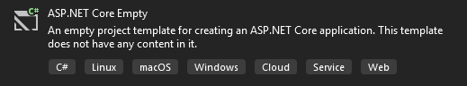
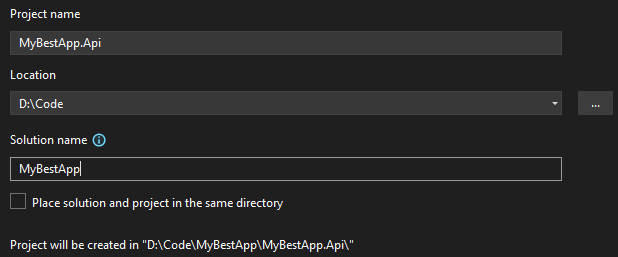
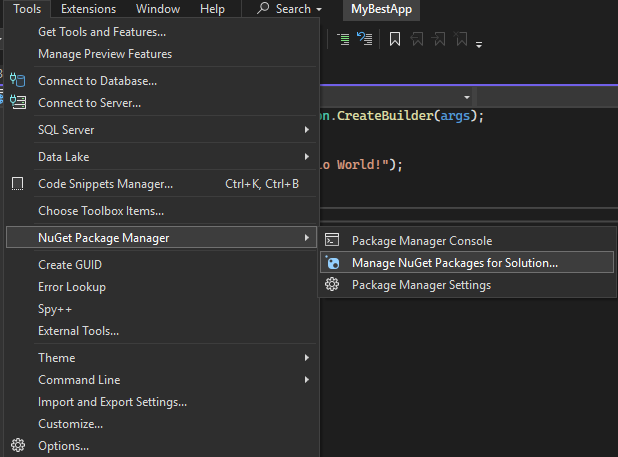
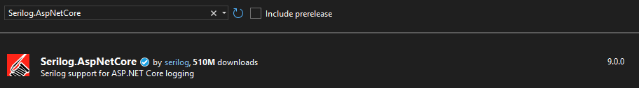
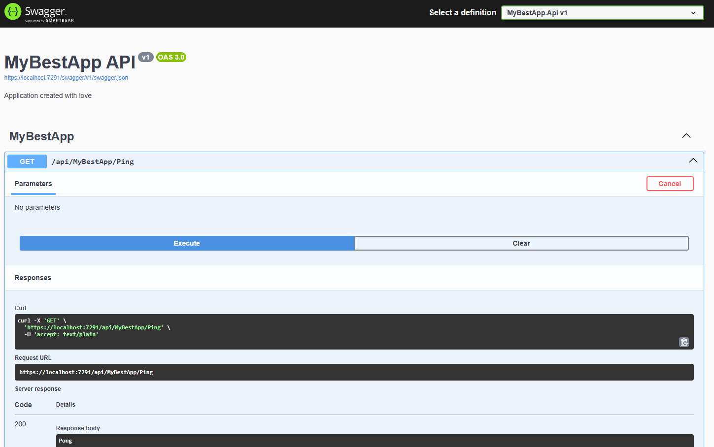
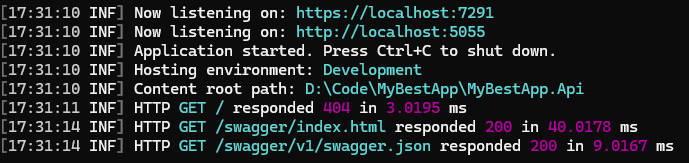

# About 
In this article I will explain how and what to set up in a new project. I will explain how and what to set up in a new project. This project will also serve as a go-to template for creating ASP.NET applications or for my teachings ASP.NET to others.

# Solution creation

Let's start from creating empty project. You can use following command.

```
dotnet new web
```
If you are using VisualStudio just pick this.



I usually name solution and name project but with ".Api".



After creating the project, you will see the following file structure.

```
MyBestApp
+-- MyBestApp.sln
+-- MyBestApp.Api
|   +-- Program.cs
|   +-- appsettings.json
|   +-- appsettings.Development.json
|   +-- MyBestApp.Api.csproj
|   +-- Properties
|       +-- launchSettings.json
```

- **MyBestApp.sln** – Solution file containing the overall solution configuration.
- **MyBestApp.Api.csproj** – Project configuration file. Lists installed packages, project references, and included folders.
- **Program.cs** – Startup file for the _MyBestApp.Api_ project.
- **appsettings.json** – Project configuration file for storing application settings. **Note:** Do not store credentials here.
- **appsettings.Development.json** – Same as `appsettings.json` but specific to the development environment.
- **launchSettings.json** – File containing launch settings.

Below is the default `Program.cs` file. I usually do not use the minimal API approach, so I will remove this line from the codebase. In this article i will show you how to do Controller based api.

``` C#
var builder = WebApplication.CreateBuilder(args);
// Place your configuration code here
var app = builder.Build();

app.MapGet("/", () => "Hello World!"); // This will be removed

app.Run();
```

# Basic configuration
To use certain features of ASP.NET or external packages, we first need to configure them.
## What Do We Need to Configure?
Since we started with an empty project, we need to configure everything from scratch.  
The basic setup includes logging, API documentation (Swagger), and a CORS policy.  
Additionally, we must configure a controller-based API. For logging, I typically use **Serilog**.
### But why?
- Swagger is a great tool for documenting your API, and it can also be used to test it.
- Logging is useful for analyzing what is happening within your application.
- CORS allows your frontend application to communicate with the backend. This topic is more complex, but when running your frontend and backend locally, configuring CORS is often necessary.
## How I Prefer to Configure
We could place all our configuration in the section mentioned in [Configuration], but the more we configure, the messier the code becomes. That’s why I prefer creating extension methods to handle specific configuration tasks.
## Extension members
You can read more about them here: [https://learn.microsoft.com/en-us/dotnet/csharp/programming-guide/classes-and-structs/extension-methods](https://learn.microsoft.com/en-us/dotnet/csharp/programming-guide/classes-and-structs/extension-methods).

However, what they are can be quickly explained by the following quote:

> Extension members enable you to "add" methods to existing types without creating a new derived type, recompiling, or otherwise modifying the original type.
## Extension Methods – Implementation
I will create a new folder named `Configuration` and add a new class called `BasicConfig` inside it.

```
MyBestApp
+-- MyBestApp.sln 
+-- MyBestApp.Api
|   +-- Program.cs
|   +-- appsettings.json
|   +-- appsettings.Development.json
|   +-- MyBestApp.Api.csproj
|   +-- Properties
|       +-- launchSettings.json
|   +-- Configuration // + This was added
|       +-- BasicConfig.cs // + This was added
```

**BasicConfig.cs** – This class will handle all our configuration. I also created an extension method named `BasicConfiguration()`, where we can place all the basic configuration logic.

``` C#
namespace MyBestApp.Api.Configuration
{
    public static class BasicConfig
    {
        public static WebApplicationBuilder BasicConfiguration(this WebApplicationBuilder builder)
        {
            return builder;
        }
	}
}
```

To enable the `BasicConfiguration` method, we need to import its namespace in `Program.cs` and invoke it as shown below.

``` C#
using MyBestApp.Api.Configuration; // Required to access the extension method

var builder = WebApplication.CreateBuilder(args);
var app = builder
    .BasicConfiguration() // Extension method invocation
    .Build();

app.Run();
```

## Package instalation
Now that we know how to organize our configuration, it is time to install the required packages.

Swagger and Serilog are external packages we need to install. You can do this using the following commands:
```
nuget install Serilog.AspNetCore
nuget install Swashbuckle.AspNetCore
```

Alternatively, you can use the built-in NuGet UI tool in your IDE to install these packages.



From there, in the **Browse** tab, type the name of the package you are looking for and download it.



> [Note]
> Make sure you downlad package for your version of Dotnet
## Config implementation 
Configuration is  really straing forward. 

### Controller based web api configuration
To achieve this, add the following method in `BasicConfig.cs`:

``` C#
public static WebApplicationBuilder BasicConfiguration(this WebApplicationBuilder builder)
{
	builder.Services.AddControllers(); // Enables use of controllers

	return builder;
}
```

Then, in `Program.cs`, add:

``` C#
var app = builder
    .BasicConfiguration()
    .Build();

app.MapControllers(); // Enables routing for controllers

app.Run();
```

### Logging (Serilog) Configuration
To enable Serilog, use the following code. This configuration reads settings from `appsettings.json` and logs output to the console.

``` C#
public static WebApplicationBuilder BasicConfiguration(this WebApplicationBuilder builder)
{
	builder.Services.AddControllers(); 
	
	builder.Host
		.UseSerilog((ctx, lc) => 
			lc.ReadFrom.Configuration(ctx.Configuration));

	return builder;
}
```

In `Program.cs`, add:

``` C#
var app = builder
    .BasicConfiguration()
    .Build();
    
app.UseSerilogRequestLogging(); // Logs HTTP requests

app.MapControllers();

app.Run();
```

Add the following configuration to your `appsettings.json`:

``` JSON
{
  "Serilog": {
    "MinimumLevel": {
      "Default": "Information",
      "Override": {
      "Microsoft": "Warning",
      "Microsoft.Hosting.Lifetime": "Information"
      }
    },
    "WriteTo": [
      {
      "Name": "Console"
      }
    ]
  },
}
```

### Swagger configuration

For Swagger configuration, I prefer to create a separate method. This is mainly because the configuration can become quite extensive, and it’s a feature you typically configure once and forget. Add the following method to `BasicConfig.cs`:

``` C#
public static WebApplicationBuilder AddSwaggerSupport(this WebApplicationBuilder builder)
{
	builder.Services.AddSwaggerGen(c =>
	{
		c.SwaggerDoc("v1", new OpenApiInfo
		{
			Title = "MyBestApp API",
			Version = "v1",
			Description = "Application created with love",
		});
	});

	return builder;
}
```

In `Program.cs`, use this configuration as follows:

``` C#
var app = builder
    .BasicConfiguration()
    .AddSwaggerSupport()
    .Build();
    
app.UseSerilogRequestLogging();

app.UseSwagger();    // Enables Swagger middleware

app.UseSwaggerUI();  // Enables Swagger UI

app.MapControllers();

app.Run();
```

### CORS configuration
If you don’t have a frontend, you don’t need to configure this. Similar to the logging configuration, we retrieve CORS settings from `appsettings.json` and apply the following configuration. Start by updating `BasicConfig.cs`:

``` C#
public static WebApplicationBuilder BasicConfiguration(this WebApplicationBuilder builder)
{
	builder.Services.AddControllers(); 
	
	builder.Host 
		.UseSerilog((ctx, lc) => 
			lc.ReadFrom.Configuration(ctx.Configuration));
			
	var paths = builder.Configuration.GetSection("CORS-Paths").Get<string[]>();
	if (paths != null)
		builder.Services.AddCors(options =>
		{
			options.AddPolicy("CorsPolicy",
				builder => builder.WithOrigins(paths)
				.AllowAnyHeader()
				.AllowAnyMethod()
				.AllowCredentials()
				.SetIsOriginAllowed((host) => true));
		}); // + 

	return builder;
}
```

Add the following section to your `appsettings.json`:

``` JSON
{
  "CORS-Paths": [ // Use your frontend URLs here
    "https://localhost:7291",
    "http://localhost:5055"  
  ],
}
```

### Final configuration
Now that we have all the necessary configurations, here is how my files look:

 `BasicConfig.cs`
``` C#
using Microsoft.OpenApi.Models;
using Serilog;

namespace MyBestApp.Api.Configuration
{
    public static class BasicConfig
    {
        public static WebApplicationBuilder BasicConfiguration(this WebApplicationBuilder builder)
        {
            builder.Services.AddControllers();

            builder.Host
                .UseSerilog((ctx, lc) => lc
                .WriteTo.Console()
                .ReadFrom.Configuration(ctx.Configuration));

            var paths = builder.Configuration.GetSection("CORS-Paths").Get<string[]>();
            if (paths != null)
                builder.Services.AddCors(options =>
                {
                    options.AddPolicy("CorsPolicy",
                        builder => builder.WithOrigins(paths)
                        .AllowAnyHeader()
                        .AllowAnyMethod()
                        .AllowCredentials()
                        .SetIsOriginAllowed((host) => true));
                });

            return builder;
        }

        public static WebApplicationBuilder AddSwaggerSupport(this WebApplicationBuilder builder)
        {
            builder.Services.AddSwaggerGen(c =>
            {
                c.SwaggerDoc("v1", new OpenApiInfo
                {
                    Title = "MyBestApp API",
                    Version = "v1",
                    Description = "Application created with love",
                });
            });

            return builder;
        }
    }
}
```

`Program.cs`

``` C#
using MyBestApp.Api.Configuration;
using Serilog;

var builder = WebApplication.CreateBuilder(args);
var app = builder
    .BasicConfiguration()
    .AddSwaggerSupport()
    .Build();

app.UseSerilogRequestLogging();

app.UseSwagger();

app.UseSwaggerUI();

app.MapControllers();

app.Run();
```

`appsettings.json`

``` JSON
{
  "Serilog": {
    "MinimumLevel": {
      "Default": "Information",
      "Override": {
        "Microsoft": "Warning",
        "Microsoft.Hosting.Lifetime": "Information"
      }
    },
    "WriteTo": [
      {
        "Name": "Console"
      }
    ]
  },
  "CORS-Paths": [
    "https://localhost:7291", 
    "http://localhost:5055"
  ],
  "AllowedHosts": "*"
}
```

With this configuration, we are nearly ready to run our application. The final missing piece is creating the Controller.
# Controllers
To test the configuration, we need to create our first Controller. I will add the following to our project:
```
MyBestApp
+-- MyBestApp.sln 
+-- MyBestApp.Api
|   +-- Program.cs
|   +-- appsettings.json
|   +-- appsettings.Development.json
|   +-- MyBestApp.Api.csproj
|   +-- Properties
|       +-- launchSettings.json
|   +-- Configuration
|       +-- BasicConfig.cs
|   +-- Controllers // + This was added
|       +-- MyBestAppController.cs // + This was added
```

In `MyBestAppController.cs`, I will create an example controller containing a GET method named `Ping` that returns the string "Pong".

``` C#
using Microsoft.AspNetCore.Mvc;

namespace MyBestApp.Api.Controllers
{
    [ApiController]
    [Route("api/[controller]")]
    public class MyBestAppController : ControllerBase
    {
        [HttpGet("Ping")]
        public string PingPong()
        {
            return "Pong";
        }
    }
}
```

Now our app is ready for testing. You can access Swagger to see the new GET endpoint, and verify that logging is functioning correctly.

To access Swagger, navigate to your launch URL and append `/swagger/index.html`. This will open a page similar to the one shown below.



Exactly! This page will display your API’s documentation, including the custom description and the available endpoints like your `Ping` GET method. From here, you can easily test your API directly in the browser.



And in the console, you should see logs generated by your application, including HTTP request details and any other configured log events.
# Summary
In this article, we completed the basic setup of an ASP.NET application. We configured essential features such as Swagger, logging, and CORS, and created a simple endpoint. In the next article, I will cover more advanced topics related to building Web APIs.